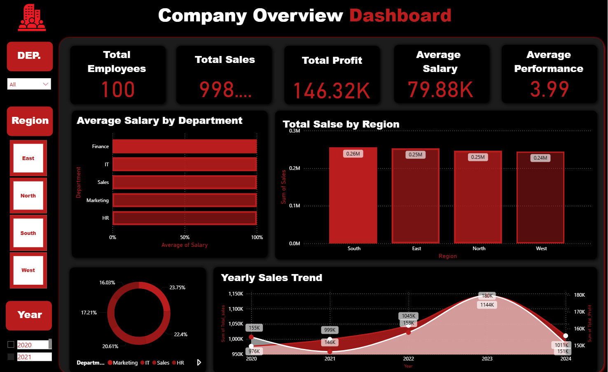
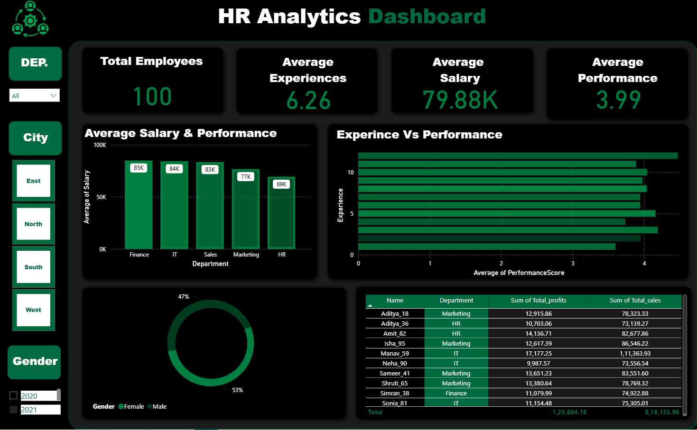

# 📊 Business Performance Analytics Platform

An end-to-end business analytics project integrating **Python, SQL, and Power BI** to transform business data into actionable insights across **sales, profitability, regional performance, and workforce analytics**.

> **Project note:** This project was developed using an existing public analytics project as a starting reference and substantially restructured, renamed, documented, and extended for portfolio purposes. Retain appropriate attribution and comply with the original project's license.

---

## 🎯 Project Overview

The project follows a complete data analytics lifecycle:

1. **Data Collection & Storage** — structured business datasets and SQL.
2. **Data Cleaning & Transformation** — Python and pandas.
3. **Exploratory Data Analysis** — trends, distributions, relationships, and anomalies.
4. **SQL Business Analysis** — joins, aggregations, KPIs, sales, HR, and profitability analysis.
5. **Power BI Modeling & Visualization** — interactive dashboards and DAX measures.
6. **Business Insights** — translate analysis into measurable observations.
7. **Recommendations** — identify data-supported areas for business action.

---

## 🧩 Business Questions

### Sales & Revenue
- What are the monthly sales and revenue trends?
- Which products generate the highest revenue?
- Which regions contribute the most revenue?
- Which salespeople have the strongest sales performance?
- How does discounting affect profitability?

### Profitability
- What is the overall profit margin?
- Which products and regions are most profitable?
- Which areas generate high revenue but comparatively low margins?
- How does discount level relate to profit?

### Workforce Analytics
- Which departments have the highest employee count?
- What is the average performance by department?
- How are salary and experience distributed?
- Which departments contribute the highest employee-related cost?

---

## 🛠️ Tech Stack

| Technology | Purpose |
|---|---|
| **Python** | Data cleaning, transformation, EDA |
| **Pandas** | Data manipulation |
| **NumPy** | Numerical analysis |
| **Matplotlib / Seaborn** | Exploratory visualization |
| **SQL / SQLite** | Business analysis and KPI queries |
| **Power BI** | Interactive dashboards |
| **DAX** | Measures and business KPIs |
| **Excel / CSV** | Source data |

---

## 📁 Recommended Project Structure

```text
business-performance-analytics/
│
├── data/
│   ├── raw/
│   └── processed/
│
├── notebooks/
│   └── exploratory_analysis.ipynb
│
├── sql/
│   ├── 01_data_exploration.sql
│   ├── 02_sales_analysis.sql
│   ├── 03_employee_analysis.sql
│   ├── 04_profitability_analysis.sql
│   └── 05_business_kpis.sql
│
├── powerbi/
│   └── business_performance_dashboard.pbix
│
├── reports/
│   └── business_insights.md
│
├── screenshots/
│   ├── company_overview_dashboard.png
│   └── hr_analytics_dashboard.png
│
├── README.md
├── requirements.txt
└── .gitignore
```

---

## 🔄 Data Analysis Workflow

```text
Raw Business Data
       ↓
Data Validation
       ↓
Python / Pandas
       ↓
Cleaning & Transformation
       ↓
Exploratory Data Analysis
       ↓
SQL Analysis
       ↓
KPI & Business Metrics
       ↓
Power BI + DAX
       ↓
Interactive Dashboards
       ↓
Business Insights
       ↓
Recommendations
```

---

## 📈 Core KPIs

The final dashboard should calculate KPIs such as:

- **Total Revenue**
- **Total Profit**
- **Profit Margin %**
- **Total Orders**
- **Average Order Value**
- **Total Employees**
- **Revenue per Employee**
- **Regional Revenue**
- **Product Revenue**
- **Product Profitability**
- **Department Performance**

> Replace all numerical claims from the reference project with values calculated from your final dataset.

---

## 📊 Power BI Dashboard

### 1. Executive Overview

- Revenue
- Profit
- Profit Margin
- Orders
- Employee Count
- Revenue Trend
- Profit Trend
- Regional Performance
- Top Products

### 2. Sales Analytics

- Monthly revenue trend
- Product performance
- Regional sales
- Salesperson performance
- Order analysis
- Discount analysis

### 3. Workforce Analytics

- Employee headcount
- Department distribution
- Average salary
- Experience analysis
- Department performance
- Employee-related cost metrics

### 4. Profitability Analytics

- Revenue vs. cost
- Profit margin
- Product profitability
- Regional profitability
- Discount vs. profit
- High-revenue / low-margin segments

---

## 🧮 Example DAX Measures

Adapt table and column names to your final model:

```DAX
Total Revenue = SUM(Sales[Revenue])

Total Profit = SUM(Sales[Profit])

Profit Margin % =
DIVIDE([Total Profit], [Total Revenue], 0)

Total Orders = DISTINCTCOUNT(Sales[Order_ID])

Average Order Value =
DIVIDE([Total Revenue], [Total Orders], 0)
```

---

## 🔎 SQL Analysis

Create separate SQL files for:

- Data exploration
- Revenue analysis
- Profitability analysis
- Regional performance
- Product performance
- Employee/department analysis
- KPI calculations
- Discount impact
- Top-performing segments

Example:

```sql
SELECT
    Region,
    SUM(Revenue) AS total_revenue,
    SUM(Profit) AS total_profit,
    ROUND(
        SUM(Profit) * 100.0 / NULLIF(SUM(Revenue), 0),
        2
    ) AS profit_margin_pct
FROM Sales
GROUP BY Region
ORDER BY total_revenue DESC;
```

---

## 🐍 Python Analysis

Use Python for:

- Missing-value inspection
- Duplicate detection
- Data-type validation
- Data cleaning
- Feature preparation
- Descriptive statistics
- Trend analysis
- Outlier investigation
- Exploratory visualizations

Example:

```python
import pandas as pd

df = pd.read_csv("data/raw/sales.csv")

print(df.info())
print(df.isnull().sum())
print(df.describe())

df = df.drop_duplicates()

df["Revenue"] = pd.to_numeric(df["Revenue"], errors="coerce")
df["Profit"] = pd.to_numeric(df["Profit"], errors="coerce")

df.to_csv("data/processed/clean_sales.csv", index=False)
```

---

## 💡 Business Insights

The final insights must come from **your final dataset and analysis**.

Document findings such as:

- Revenue trends across time.
- Regional differences in revenue and profitability.
- Products with strong revenue but weaker margins.
- The relationship between discount levels and profitability.
- Department-level differences in workforce performance.
- Areas requiring additional investigation.

Do not copy numerical findings from the reference README.

---

## 💼 Business Recommendations

Examples of recommendation categories:

- Investigate high-revenue segments with low profit margins.
- Review discount policies where increased discounts are associated with weaker margins.
- Analyze consistently high-performing products and regions for scalable opportunities.
- Investigate departments with unusually high costs relative to performance metrics.
- Establish recurring KPI monitoring for management reporting.

---
## 📸 Dashboard Preview

### Company Overview Dashboard

<p align="center">
  
</p>

### HR Analytics Dashboard

<p align="center">
  
</p>

---

## 🚀 How to Run

### 1. Clone

```bash
git clone https://github.com/YOUR_USERNAME/business-performance-analytics.git
cd business-performance-analytics
```

### 2. Create virtual environment

Windows:

```bash
python -m venv venv
venv\Scripts\activate
```

### 3. Install dependencies

```bash
pip install -r requirements.txt
```

### 4. Run notebook

```bash
jupyter notebook
```

Open:

```text
notebooks/exploratory_analysis.ipynb
```

### 5. Run SQL

Open the SQL files inside:

```text
sql/
```

with SQLite-compatible tooling.

### 6. Open Power BI

Open:

```text
powerbi/business_performance_dashboard.pbix
```

and refresh the data sources if required.

---

## 📦 requirements.txt

```text
pandas
numpy
matplotlib
seaborn
openpyxl
jupyter
```

---

## 🔮 Future Improvements

- Automated data-refresh pipeline
- Advanced DAX measures
- Customer segmentation
- Revenue and profit forecasting
- Anomaly detection
- Live SQL database connection
- Automated KPI reporting
- Dashboard deployment

---

## 👨‍💻 Author

**Rishabh**  
Data Analyst | Python · SQL · Power BI

- GitHub: `https://github.com/rishabh-1617`
- LinkedIn: `https://www.linkedin.com/in/rishabhprajapati1606/`
- Email: `rishabhyt.1617@gmail.com`

---

## 📌 Portfolio Note

This project is intended for educational and portfolio purposes. The final repository should contain your own analysis, dashboard design, documentation, and meaningful modifications. External projects and datasets used as references should be attributed and used according to their applicable licenses.
